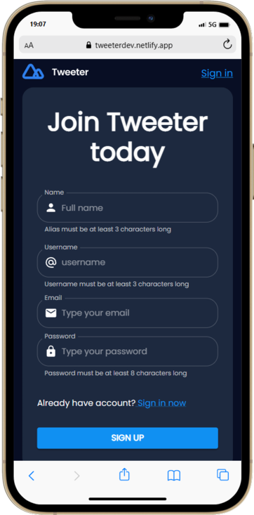
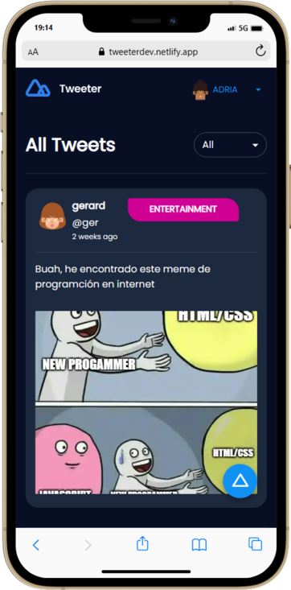
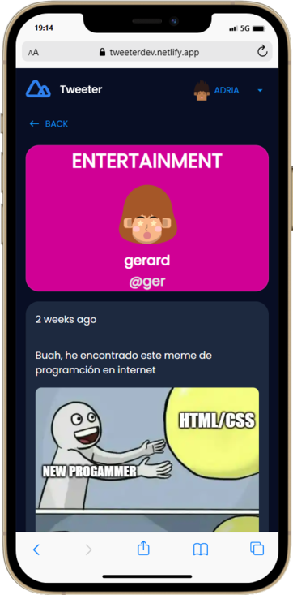
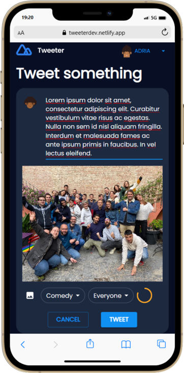

[](https://app.netlify.com/sites/tweeterdev/deploys)

[](https://sonarcloud.io/summary/new_code?id=isdi-coders-2022_Adria-Martinez_Front-Final-Project-202209-BCN)
[](https://sonarcloud.io/summary/new_code?id=isdi-coders-2022_Adria-Martinez_Front-Final-Project-202209-BCN)
[](https://sonarcloud.io/summary/new_code?id=isdi-coders-2022_Adria-Martinez_Front-Final-Project-202209-BCN)
[](https://sonarcloud.io/summary/new_code?id=isdi-coders-2022_Adria-Martinez_Front-Final-Project-202209-BCN)

[](https://sonarcloud.io/summary/new_code?id=isdi-coders-2022_Adria-Martinez_Front-Final-Project-202209-BCN)

## Table of contents

- [About](#about)
- [Demo](#demo)
- [Technology stack](#technology-stack)
- [Features](#features)
- [Images](#images)
- [Installation](#installation)
- [Usage](#usage)

## About

Tweeter is a clone of Twitter where you can create tweets, each user can create,edit and delete their tweets.

You can install Tweeter in your computer because is a Progressive Web App (PWA)

Has been developed using CI/CD with Github Actions, SonarCloud and Netlify.

The main goal of this project is to have a 100% coverage in the tests and a good quality code. During the development each new feature have been tested and this is the way that i have been able to achieve the 100% coverage.

## Demo

You can see the project deployed in [Netlify](https://tweeterdev.netlify.app/)

> If you dont want to register you can use this user to test the app:
>
> - Email: adria@gmail.com
> - Password: 1234567890

### Backend

Tweeter is a full stack project, you can see the [backend project ](https://github.com/Jacky16/Tweeter-Back).

## Technology stack

- React
- Typescript
- Redux
- React Router
- Material UI
- Axios
- Jest
- React Testing Library
- Styled Components

## Features

- Filter tweets by category
- Delete and edit tweets if you are the author
- Secure authentication with Json Web Token

## Images








## Installation

To run the project you need to clone the repository and install the dependencies with the following commands:

```bash
npm install
```

## Usage

To run the project in development mode you can use the following command:

```bash
npm start
```
